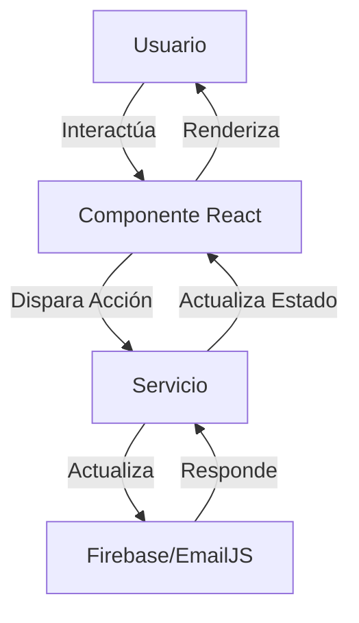

# 🛒 Gestor Lista de Mercado

## 📝 Descripción
Aplicación web responsiva para gestionar listas de mercado, permitiendo a los usuarios registrar productos, organizar compras por categorías, comparar precios entre diferentes meses y llevar un control detallado de gastos en supermercado.

## 🎯 Características Principales

### 🔐 Autenticación y Seguridad
- Múltiples métodos de inicio de sesión:
  - Google
  - GitHub
  - Correo electrónico y contraseña
- Gestión segura de contraseñas
- Protección de rutas privadas
- Cierre de sesión seguro

### 📦 Gestión de Productos
- Agregar productos con:
  - Nombre
  - Marca
  - Precio
  - Unidad de medida
  - Categoría
  - Tienda asociada
- Actualización de información de productos
- Desactivación de productos no necesarios
- Filtrado por múltiples criterios

### 🏪 Gestión de Tiendas
- Crear y editar tiendas
- Asociar productos a tiendas específicas
- Gestionar múltiples tiendas por usuario

### 📊 Análisis de Precios
- Comparación de precios entre meses
- Gráficos de evolución de precios
- Resumen de gastos mensuales
- Calculadora de productos a granel

### 📱 Diseño Responsivo
- Interfaz adaptable a todos los dispositivos
- Diseño intuitivo y amigable
- Navegación optimizada para móviles
- Experiencia de usuario consistente

### 📞 Soporte y Asistencia
- Formulario de contacto integrado con EmailJS
- Sistema de tickets de soporte
- Documentación de ayuda
- Respuesta rápida a consultas

## 🛠️ Tecnologías Utilizadas

### Frontend
- React.js
- React Router para navegación
- React Bootstrap para UI
- Recharts para gráficos
- EmailJS para sistema de contacto

### Autenticación y Base de Datos
- Firebase Authentication
- Firebase Firestore

### Estilos y Diseño
- CSS personalizado
- Bootstrap 5
- Diseño responsivo con Media Queries

## 🔧 Detalles Técnicos y Ejemplos de Implementación

### 🔐 Configuración de Firebase
```javascript
// src/services/firebaseConfig.js
import { initializeApp } from 'firebase/app';
import { getAuth } from 'firebase/auth';
import { getFirestore } from 'firebase/firestore';

const firebaseConfig = {
  apiKey: process.env.REACT_APP_FIREBASE_API_KEY,
  authDomain: process.env.REACT_APP_FIREBASE_AUTH_DOMAIN,
  projectId: process.env.REACT_APP_FIREBASE_PROJECT_ID,
  storageBucket: process.env.REACT_APP_FIREBASE_STORAGE_BUCKET,
  messagingSenderId: process.env.REACT_APP_FIREBASE_MESSAGING_SENDER_ID,
  appId: process.env.REACT_APP_FIREBASE_APP_ID
};

const app = initializeApp(firebaseConfig);
export const auth = getAuth(app);
export const db = getFirestore(app);
```

### 📧 Implementación del Sistema de Contacto
```javascript
// src/pages/Contacto.js
const handleSubmit = async (e) => {
  e.preventDefault();
  setLoading(true);
  
  try {
    await emailjs.sendForm(
      'service_67gzh7c',
      'template_iat4brq',
      form.current,
      'otMBvxVALs1C_-wVc'
    );
    
    setStatus({
      type: 'success',
      message: '¡Mensaje enviado exitosamente!'
    });
  } catch (error) {
    setStatus({
      type: 'danger',
      message: 'Error al enviar el mensaje'
    });
  }
  
  setLoading(false);
};
```

### 📊 Visualización de Datos con Recharts
```javascript
// src/components/PriceAnalysis.js
<ResponsiveContainer width="100%" height={400}>
  <LineChart data={priceHistory}>
    <CartesianGrid strokeDasharray="3 3" />
    <XAxis dataKey="month" />
    <YAxis />
    <Tooltip />
    <Legend />
    <Line 
      type="monotone" 
      dataKey="price" 
      stroke="#2E7D32"
      name="Precio" 
    />
  </LineChart>
</ResponsiveContainer>
```

### 🛡️ Protección de Rutas
```javascript
// src/components/PrivateRoute.js
import { Navigate } from 'react-router-dom';
import { useAuth } from '../contexts/AuthContext';

const PrivateRoute = ({ children }) => {
  const { currentUser } = useAuth();
  
  return currentUser ? children : <Navigate to="/login" />;
};
```

### 🎨 Estilos Responsivos
```css
/* src/styles.css */
.dashboard {
  display: grid;
  grid-template-columns: repeat(auto-fit, minmax(300px, 1fr));
  gap: 1.5rem;
  padding: 1rem;
}

@media (max-width: 768px) {
  .dashboard {
    grid-template-columns: 1fr;
  }
  
  .stats-overview {
    flex-direction: column;
  }
}
```

## 📚 Estructura del Proyecto
```
gestor-lista-mercado/
├── src/
│   ├── components/          # Componentes reutilizables
│   │   ├── Header.js
│   │   ├── ProductForm.js
│   │   └── PriceAnalysis.js
│   ├── contexts/           # Contextos de React
│   │   └── AuthContext.js
│   ├── pages/             # Páginas principales
│   │   ├── Dashboard.js
│   │   ├── Products.js
│   │   └── Contacto.js
│   ├── services/          # Servicios y configuraciones
│   │   ├── firebaseConfig.js
│   │   └── authServices.js
│   └── styles/            # Archivos de estilos
│       ├── styles.css
│       └── custom.css
├── public/
│   └── index.html
└── package.json
```

## 🔄 Flujo de Datos


## 📦 Dependencias Principales
```json
{
  "dependencies": {
    "@emailjs/browser": "^3.11.0",
    "bootstrap": "^5.2.3",
    "firebase": "^9.17.2",
    "react": "^18.2.0",
    "react-bootstrap": "^2.7.2",
    "react-router-dom": "^6.8.2",
    "recharts": "^2.4.3"
  }
}
```

## 🚀 Scripts Disponibles
```bash
# Iniciar en modo desarrollo
npm start

# Construir para producción
npm run build

# Ejecutar pruebas
npm test

# Ejecutar pruebas con cobertura
npm run test:coverage
```

## 🔍 Ejemplos de Uso

### Autenticación con Google
```javascript
const handleGoogleLogin = async () => {
  try {
    await loginWithGoogle();
    navigate('/dashboard');
  } catch (error) {
    setError('Error al iniciar sesión con Google');
  }
};
```

### Agregar un Producto
```javascript
const addProduct = async (productData) => {
  try {
    const docRef = await addDoc(collection(db, 'products'), {
      ...productData,
      userId: currentUser.uid,
      createdAt: serverTimestamp()
    });
    return docRef.id;
  } catch (error) {
    console.error('Error al agregar producto:', error);
    throw error;
  }
};
```

### Análisis de Precios
```javascript
const calculatePriceStats = (products) => {
  return products.reduce((stats, product) => ({
    total: stats.total + product.price,
    average: (stats.total + product.price) / (stats.count + 1),
    count: stats.count + 1,
    max: Math.max(stats.max, product.price),
    min: Math.min(stats.min, product.price)
  }), { total: 0, average: 0, count: 0, max: 0, min: Infinity });
};
```

## 📋 Requisitos Previos
- Node.js (v14 o superior)
- npm (v6 o superior)
- Cuenta de Firebase
- Cuenta de EmailJS

## 🚀 Instalación y Configuración

1. **Clonar el repositorio**
   ```bash
   git clone [URL_DEL_REPOSITORIO]
   cd gestor-lista-mercado
   ```

2. **Instalar dependencias**
   ```bash
   npm install
   ```

3. **Configurar Firebase**
   - Crear proyecto en Firebase Console
   - Habilitar Authentication y Firestore
   - Copiar credenciales de configuración

4. **Configurar EmailJS**
   - Crear cuenta en EmailJS
   - Configurar servicio de email
   - Crear plantilla de email
   - Obtener credenciales:
     - Service ID
     - Template ID
     - Public Key

5. **Configurar variables de entorno**
   Crear archivo `.env` con:
   ```
   REACT_APP_FIREBASE_API_KEY=tu_api_key
   REACT_APP_FIREBASE_AUTH_DOMAIN=tu_auth_domain
   REACT_APP_FIREBASE_PROJECT_ID=tu_project_id
   REACT_APP_FIREBASE_STORAGE_BUCKET=tu_storage_bucket
   REACT_APP_FIREBASE_MESSAGING_SENDER_ID=tu_messaging_sender_id
   REACT_APP_FIREBASE_APP_ID=tu_app_id
   ```

6. **Iniciar la aplicación**
   ```bash
   npm start
   ```

## 📱 Uso de la Aplicación

### 1. Registro e Inicio de Sesión
- Acceder a la página principal
- Seleccionar método de registro preferido
- Completar información requerida
- Iniciar sesión con credenciales

### 2. Gestión de Productos
- Ir a "Gestión de Productos"
- Usar formulario para agregar productos
- Editar productos existentes
- Filtrar y buscar productos

### 3. Análisis de Precios
- Acceder a "Análisis de Precios"
- Seleccionar rango de fechas
- Ver gráficos comparativos
- Consultar estadísticas

### 4. Soporte
- Ir a "Contacto"
- Llenar formulario de contacto
- Enviar consulta
- Esperar respuesta por email

## 🔍 Funcionalidades por Sprint

### Sprint 1: Fundamentos
✅ Gestión básica de productos
✅ Sistema de autenticación
✅ CRUD de tiendas y categorías

### Sprint 2: Optimización
✅ Filtros avanzados
✅ Comparación de precios
✅ Estadísticas de gastos

### Sprint 3: Mejoras
✅ Diseño responsivo
✅ Sistema de soporte
✅ Pruebas de seguridad

## 👥 Contribución
1. Fork del repositorio
2. Crear rama para feature
   ```bash
   git checkout -b feature/NuevaCaracteristica
   ```
3. Commit de cambios
   ```bash
   git commit -m 'Agregar nueva característica'
   ```
4. Push a la rama
   ```bash
   git push origin feature/NuevaCaracteristica
   ```
5. Crear Pull Request


## 📞 Contacto
Para soporte o consultas:
- Email: stivenhenaoronaldo1187@gmail.com
- Teléfono: +1 234 567 890
- Horario: Lunes a Viernes, 9:00 AM - 6:00 PM


